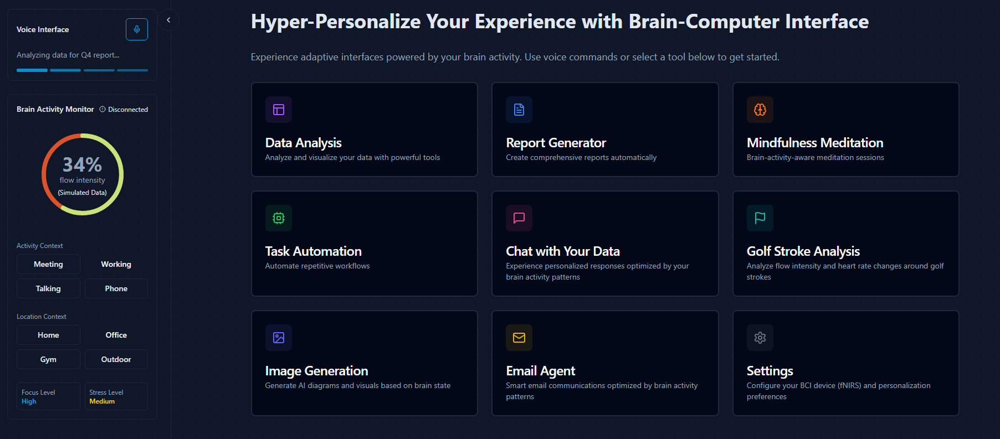

# TypeAgent BCI Sample

This repository is a work in progress demonstration showcasing how AI Agents can be personalized using Brain Computer Interfaces (BCI).

The goal of this project is to explore how brain signals (fNIRS) can be used to customize and enhance interactions with AI Agents, creating a more personalized and intuitive experience. It is powered by [TypeAgent](https://github.com/microsoft/TypeAgent) and [Azure AI Foundry](https://ai.azure.com/), and uses the [BlueberryX BCI Device](https://blueberryx.com/) to collect brain signals.

> [!WARNING] 
> Status: Work in Progress.

This is an experimental project that combines:

- fNIRS brain activity data
- AI Agent interactions, mediated by TypeAgent
- Personalization through neural signals

## Example use case (golf)

https://github.com/user-attachments/assets/2c194c40-8046-43b3-9faf-adbae6f28023

## Technologies Used

Built with:
- Vite
- TypeScript  
- TypeAgent
- Azure AI Foundry

## Requirements

- Node.js & npm installed
- [BlueberryX BCI Device](https://blueberryx.com/) for fNIRS data

## Local Development
