# TypeAgent BCI Sample

This repository is a work in progress demonstration showcasing how AI Agents can be personalized using Brain Computer Interfaces (BCI).

The goal of this project is to explore how brain signals (fNIRS) can be used to customize and enhance interactions with AI Agents, creating a more personalized and intuitive experience. It is powered by [TypeAgent](https://github.com/microsoft/TypeAgent) and [Azure AI Foundry](https://ai.azure.com/), and uses the [BlueberryX BCI Device](https://blueberryx.com/) to collect brain signals.

> [!WARNING] 
> Status: Work in Progress.

This is an experimental project that combines:

- fNIRS brain activity data
- AI Agent interactions, mediated by TypeAgent
- Personalization through neural signals


## Example use case (golf)

https://github.com/user-attachments/assets/2c194c40-8046-43b3-9faf-adbae6f28023

## System Architecture

Below is a detailed architecture diagram showing how the various components of the system interact:

```mermaid
flowchart LR
    %% Define styles
    classDef azureService fill:#0072C6,color:white,stroke:#0072C6,stroke-width:2px
    classDef azureFoundry fill:#5E4DB2,color:white,stroke:#5E4DB2,stroke-width:2px
    classDef inputSource fill:#7FBA00,color:white,stroke:#7FBA00,stroke-width:2px
    classDef agent fill:#F25022,color:white,stroke:#F25022,stroke-width:2px
    classDef subAgent fill:#FFB900,color:white,stroke:#FFB900,stroke-width:2px
    classDef dataStore fill:#00BCF2,color:white,stroke:#00BCF2,stroke-width:2px
    classDef outputAction fill:#B4A0FF,color:black,stroke:#8661C5,stroke-width:2px
    classDef azureContainer fill:#0078D7,color:white,stroke:#0078D7,stroke-width:1px,stroke-dasharray: 5 5
    classDef sportInput fill:#107C10,color:white,stroke:#107C10,stroke-width:2px
    classDef model fill:#E3008C,color:white,stroke:#E3008C,stroke-width:2px

    %% --- Input Sources Column ---
    subgraph InputSources["Input Sources"]
        direction TB
        VI["🎤 Voice & Text Input"]:::inputSource
        EM["📧 Email"]:::inputSource
        TM["💬 Teams Message"]:::inputSource
        TR["⏲️ Timer"]:::inputSource
        BS["🧠 Biosensors\n(fNIRS, Audio, etc.)"]:::inputSource
        PH["📱 Phone Gateway\n(Bluetooth/WiFi)"]:::inputSource
        GH["🏌️ Golf Hat\n(Flow, Heart Rate)"]:::sportInput
    end
   
    %% --- Azure Platform ---
    subgraph AzurePlatform["Microsoft Azure Platform"]
        direction TB
       
        %% --- Integration Services ---
        subgraph IntegrationServices["Integration Services"]
            direction TB
            EG["⚡ Event Grid"]:::azureService
            EH["🔄 Event Hubs\n(Kafka)"]:::azureService
        end
       
        %% --- Agent System ---
        subgraph AgentSystem["Agent System (Container Apps)"]
            direction TB
            MA["🤖 Meta Agent\npowered by Type Agent"]:::agent
           
            subgraph SubAgents["Sub-Agents"]
                direction TB
                DRA["📚 Deep Research Agent"]:::subAgent
                DSA["🎨 Designer Agent"]:::subAgent
                GMA["🧘 Guided Meditation Agent"]:::subAgent
                EMA["📧 Email Agent"]:::subAgent
                GSA["🏌️ Golf Stroke Analysis Agent"]:::subAgent
            end
        end
       
        %% --- Data & AI Services ---
        subgraph DataAIServices["Data & AI Services"]
            direction TB
            CDB["🗄️ Cosmos DB"]:::dataStore
           
            subgraph AIServices["AI Services"]
                direction TB
                ACS["🔍 Azure AI Search"]:::azureService
                AF["⚙️ Azure Functions"]:::azureService
                AD["📊 Azure Data Explorer"]:::azureService
            end
           
            subgraph AOAI_Service["Azure OpenAI Service"]
                direction TB
               
                subgraph AOAI_Models["Models"]
                    direction TB
                    GPT4O["🔮 GPT-4o"]:::model
                    O3MINI["⚡ o3-mini"]:::model
                    D3["🎨 DALL-E 3"]:::model
                end
            end
           
            subgraph AIF["Azure AI Foundry"]
                direction TB
                AIAS["⚙️ AI Agent Service\n(Tools: Bing, Functions, Knowledge Retrieval)"]:::azureFoundry
            end
        end
    end

    %% --- Outputs Column ---
    subgraph Outputs["Generated Outputs"]
        direction TB
        RPT["📄 Research Report\n(Reading level adjusted by brain state)"]:::outputAction
        DES["🖼️ AI-Generated Diagrams\n(Adjusted by brain state)"]:::outputAction
        MED["🎵 Meditation Instructions & Music\n(Based on brain state)"]:::outputAction
        COMM["📨 Communications\n(Emails, Messages)"]:::outputAction
        GOLF["🏌️ Interactive Golf Dashboard\n(Flow & heart rate optimized swing analysis)"]:::outputAction
    end

    %% --- Flow Connections ---
    %% Input to Integration Services
    VI --> MA
    EM --> EG
    TM --> EG
    TR --> EG
    BS --> PH
    PH --> EH
    GH --> EG
   
    %% Integration to Processing
    EG --> MA
    EH --> CDB
   
    %% Bidirectional flow with Cosmos DB
    MA <--> CDB
   
    %% Meta Agent to Sub-Agents
    MA --> DRA
    MA --> DSA
    MA --> GMA
    MA --> EMA
    MA --> GSA
   
    %% Sub-Agent connections to Azure Services
    DRA --> AIAS
    AIAS --> ACS
    AIAS --> AF
    DSA --> AOAI_Models
    GMA --> AOAI_Models
    GSA --> AD
    GSA <--> CDB
   
    %% OpenAI model connections
    DRA --> GPT4O
   
    %% Sub-Agents to Outputs
    DRA ==> RPT
    DSA ==> DES
    GMA ==> MED
    EMA ==> COMM
    GSA ==> GOLF

    %% Apply Azure container class
    class AzurePlatform azureContainer
```



### Architecture Overview

The system architecture consists of several key components:

1. **Input Sources**
   - Various input methods including voice, text, email, and Teams messages
   - Biosensors (fNIRS) for brain activity monitoring
   - Specialized sports equipment (Golf Hat) for performance metrics

2. **Azure Platform Integration**
   - Event Grid and Event Hubs for real-time event processing
   - Container Apps hosting the TypeAgent-powered Meta Agent
   - Specialized sub-agents for different tasks (research, design, meditation, etc.)

3. **Data & AI Services**
   - Cosmos DB for data storage
   - Azure OpenAI Service with multiple models (GPT-4o, o3-mini, DALL-E 3)
   - Azure AI Foundry for agent services and tools
   - Azure AI Search and Data Explorer for data analysis

4. **Generated Outputs**
   - Brain state-adjusted research reports and diagrams
   - Personalized meditation instructions
   - Automated communications
   - Interactive golf performance analysis

The architecture is designed to be scalable and modular, allowing for easy addition of new input sources, agents, and output types. The system uses brain-computer interface data to personalize and optimize the AI interactions for each user.

## Getting Started

### Prerequisites

- Node.js (v16 or higher)
- pnpm (v8 or higher)
- Azure Maps subscription key
- [BlueberryX BCI Device](https://blueberryx.com/) for fNIRS data

### Installation

1. Clone the repository:
```bash
git clone <repository-url>
cd <repository-name>
```

2. Install dependencies using pnpm:
```bash
pnpm install
```

3. Set up environment variables:
   - Copy `.env.example` to `.env`:
   ```bash
   cp .env.example .env
   ```
   - Edit `.env` and add your Azure Maps subscription key:
   ```
   NEXT_PUBLIC_AZURE_MAPS_SUBSCRIPTION_KEY=your_azure_maps_key_here
   ```

### Getting Azure Maps API Key

1. Go to the [Azure Portal](https://portal.azure.com)
2. Create a new Azure Maps account or use an existing one
3. Navigate to your Azure Maps account
4. Go to "Authentication" in the left sidebar
5. Copy your primary key
6. Paste it in your `.env` file

### Development

1. Start the backend server:
```bash
cd backend
pnpm install
pnpm build    # Build the TypeScript files first
pnpm start
```
The backend API will start on port 4518.

2. In a new terminal, start the frontend development server:
```bash
# In the root directory
pnpm install
pnpm dev
```
The frontend application will be available at `http://localhost:4517`.

For development with hot reload on the backend:
```bash
cd backend
pnpm dev     # This will watch for changes and rebuild automatically
```

### Building for Production

To create a production build:

```bash
pnpm build
```

## Project Structure

```
├── src/              # Frontend source code
│   ├── components/   # Reusable React components
│   ├── pages/        # Application pages/routes
│   ├── hooks/        # Custom React hooks
│   └── styles/       # Global styles
├── backend/          # Backend server code
│   ├── src/          # Backend source code
│   ├── dist/         # Compiled backend code
│   └── package.json  # Backend dependencies
├── public/           # Static assets
├── .env.example      # Example environment variables
├── .gitignore       # Git ignore rules
└── package.json      # Frontend dependencies and scripts
```

## Technologies Used

Built with:
- Next.js for the framework
- Azure Maps for golf course visualization
- Recharts for data visualization
- Leaflet for mapping functionality
- TailwindCSS for styling
- TypeAgent
- Azure AI Foundry
- Vite
- TypeScript

## Dependencies

Key dependencies include:
- Next.js
- Azure Maps
- Recharts
- Leaflet
- TailwindCSS
- TypeAgent
- Azure AI Foundry

## Environment Variables

The following environment variables are required:

- `NEXT_PUBLIC_AZURE_MAPS_SUBSCRIPTION_KEY`: Your Azure Maps subscription key

## Contributing

1. Create a feature branch
2. Commit your changes
3. Push to the branch
4. Create a Pull Request

## License

[Add your license here]

## Technologies Used

Built with:
- Vite
- TypeScript  
- TypeAgent
- Azure AI Foundry

## Requirements

- Node.js & npm installed
- [BlueberryX BCI Device](https://blueberryx.com/) for fNIRS data
